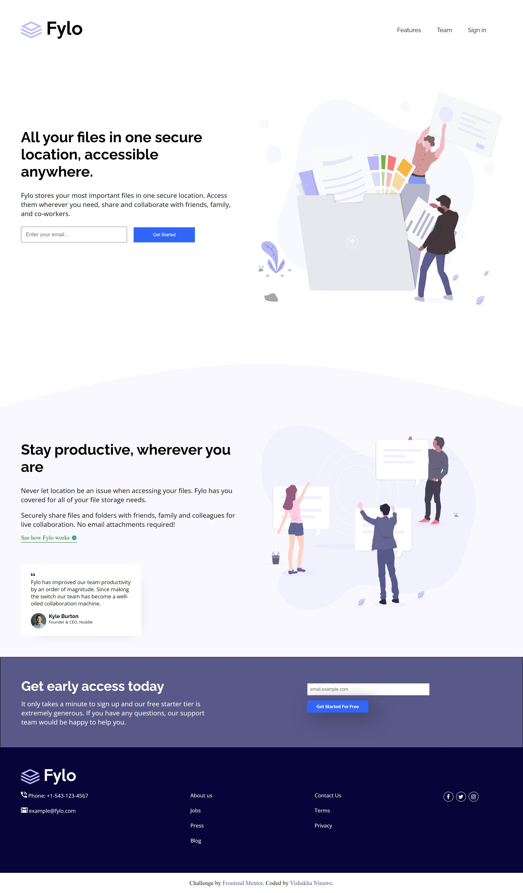
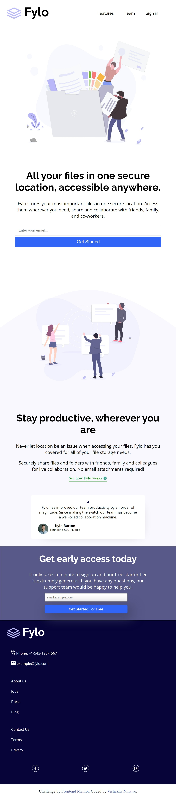

# Fylo-landing-page
# Frontend Mentor - Fylo landing page with two column layout solution

This is a solution to the [Fylo landing page with two column layout challenge on Frontend Mentor](https://www.frontendmentor.io/challenges/fylo-landing-page-with-two-column-layout-5ca5ef041e82137ec91a50f5). Frontend Mentor challenges help you improve your coding skills by building realistic projects. 

## Table of contents

- [Frontend Mentor - Fylo landing page with two column layout solution](#frontend-mentor---fylo-landing-page-with-two-column-layout-solution)
  - [Table of contents](#table-of-contents)
  - [Overview](#overview)
    - [The challenge](#the-challenge)
    - [Screenshot](#screenshot)
      - [Desktop View Preview](#desktop-view-preview)
      - [Mobile View Preview](#mobile-view-preview)
    - [Links](#links)
  - [My process](#my-process)
    - [Built with](#built-with)
    - [What I learned](#what-i-learned)
    - [Continued development](#continued-development)
    - [Useful resources](#useful-resources)
  - [Author](#author)


## Overview

### The challenge

Users should be able to:

- View the optimal layout for the site depending on their device's screen size
- See hover states for all interactive elements on the page

### Screenshot


#### Desktop View Preview



#### Mobile View Preview



### Links

- Solution URL: https://github.com/Vishakha-17/Fylo-landing-page.git
- Live Site URL: https://vishakha-17.github.io/Fylo-landing-page/

## My process

### Built with

- Semantic HTML5 markup
- CSS custom properties
- Flexbox
- CSS Grid
- Mobile-first workflow


### What I learned


```html
<div class="container1">
            <div class="description1">
                <div class="desc_header">
                    <p class="desc_head">All your files in one secure location, accessible anywhere.</p>
                </div>
                <p class="desc_para">Fylo stores your most important files in one secure location. 
               Access them wherever you need, share and collaborate with friends, 
               family, and co-workers.</p>
               <form class="form_1" action="">
               <input class="desc_text" type="email" name="" id="email" placeholder="Enter your email..." required>
               <input class="desc_btn" type="submit" value="Get Started">
               </form>
            </div>
            
        </div>
```
```css
@media (max-width: 1260px) {
   .form_1 {
        display: block;
        position: relative;
   }

   .desc_text {
    width: 100%;
    position: relative;
    left: 0;
    top: 0;
   }

   .desc_btn {
        position: absolute;
        left: -15px;
        top: 5vh;

   }
   
    .desc_img1 {
    width: 60vh;
    height: 50vh;
    }

    .desc_img2 {
    margin-top: 8vh;
    width: 50vh;
    height: 40vh;
    }

    .card {
        margin-top: 1rem;
        width: 70%;
    }
}
```


### Continued development

Areas that I want to continue focusing on in future projects. These are the concepts I'm still not completely comfortable with or techniques I found useful that I want to refine and perfect.


### Useful resources

- [Google Fonts](https://fonts.google.com/) - This helped me for learning how can I change text in any font I want. I really liked this pattern and will use it going forward.
- [Icons Tutorial](https://www.w3schools.com/icons/default.asp) - This is an amazing article which helped me finally understand how to add icons to make webpade more attractive. I'd recommend it to anyone still learning this concept.
- [Flex Box](https://youtu.be/3YW65K6LcIA) - This was a very great video which made Flex Box concept much more clear. I'd very very recommend this video who is struggling which this very concept.
- [Grid Box](https://youtu.be/0xMQfnTU6oo) - Same as Flex Box, Grid Box also very well explained inn this video.

## Author

- Website - [Vishakha Ninawe](https://github.com/Vishakha-17)
- Frontend Mentor - [Vishakha-17](https://www.frontendmentor.io/profile/Vishakha-17)
- Twitter - [Vishakha76408997](https://twitter.com/Vishakh76408997)


